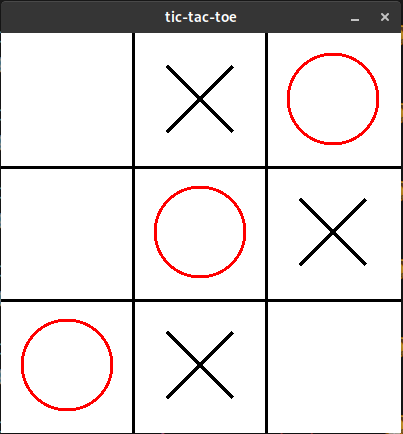

# Fractal Tree

Draw a fractal tree using golang and pixel.

<p align="center">
	<a href="">
		
	</a>
</p>

## How to run

Config the \$GOPATH stuff. Clone the repository.

```bash
$ export GOPATH=$HOME/Workspace/go
$ mkdir -p $GOPATH/src/github.com/rafaellcoellho && cd $GOPATH/src/github.com/rafaellcoellho
$ git clone git@github.com:rafaellcoellho/fractal-tree.git
```

Install the libs for pixel:

```bash
$ sudo dnf install libX11-devel libXcursor-devel libXrandr-devel libXinerama-devel mesa-libGL-devel libXi-devel
```

Get libs

```bash
$ cd fractal-tree && go get
```

Install and run:

```bash
$ go install
$ export PATH=$PATH:$GOPATH/bin
$ fractal-tree
```

## Author

- **Rafael Coelho** - [rafaellcoellho](https://github.com/rafaellcoellho)

## Reference

- [coding train video](https://www.youtube.com/watch?v=0jjeOYMjmDU)
